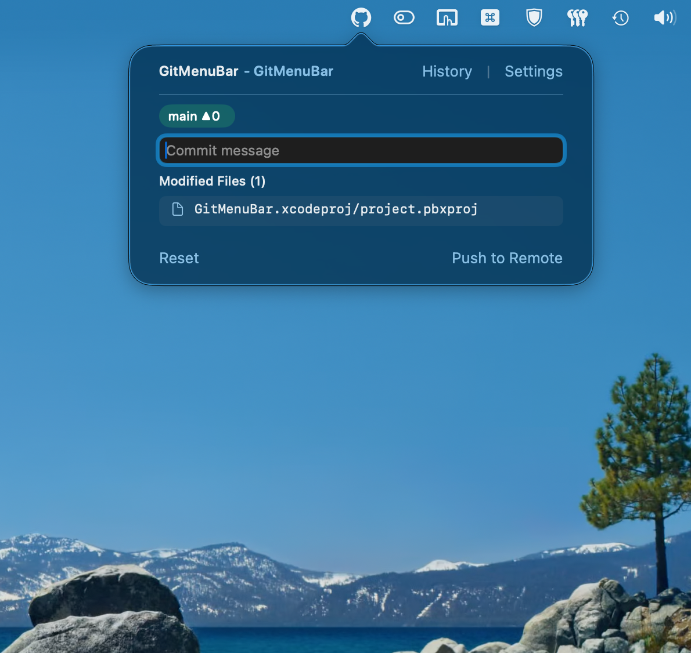
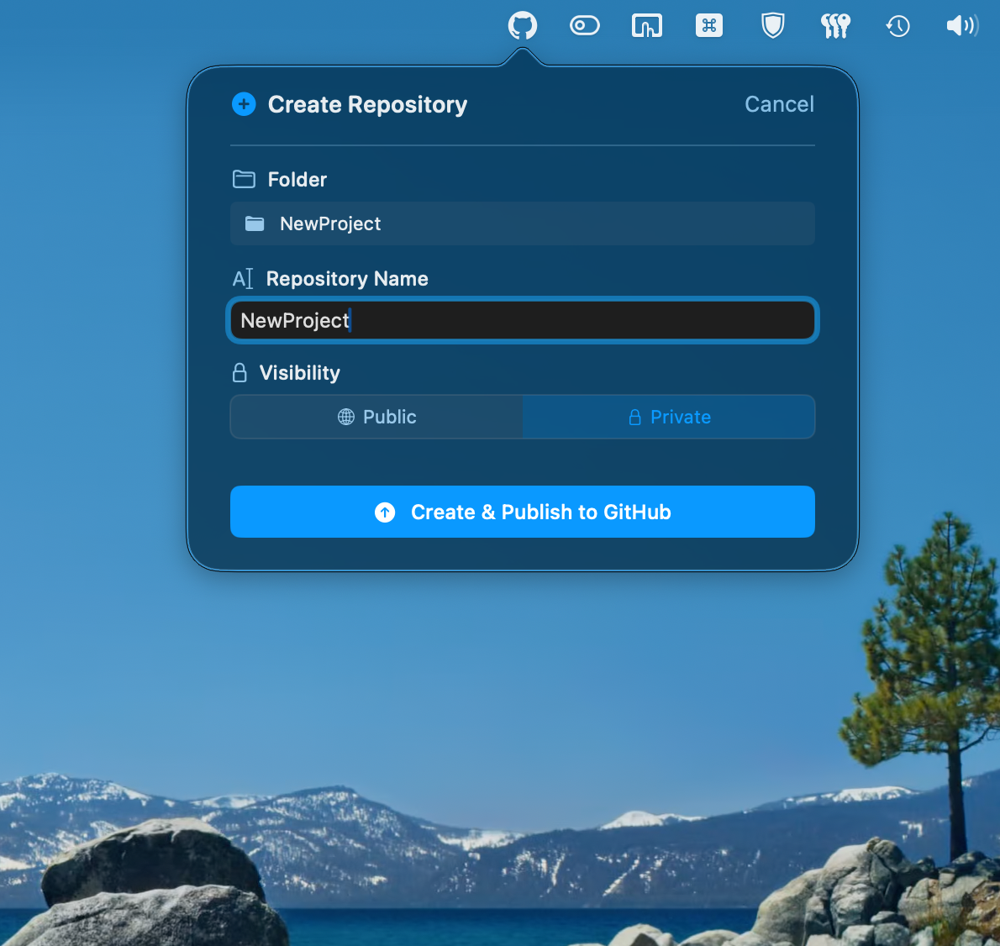
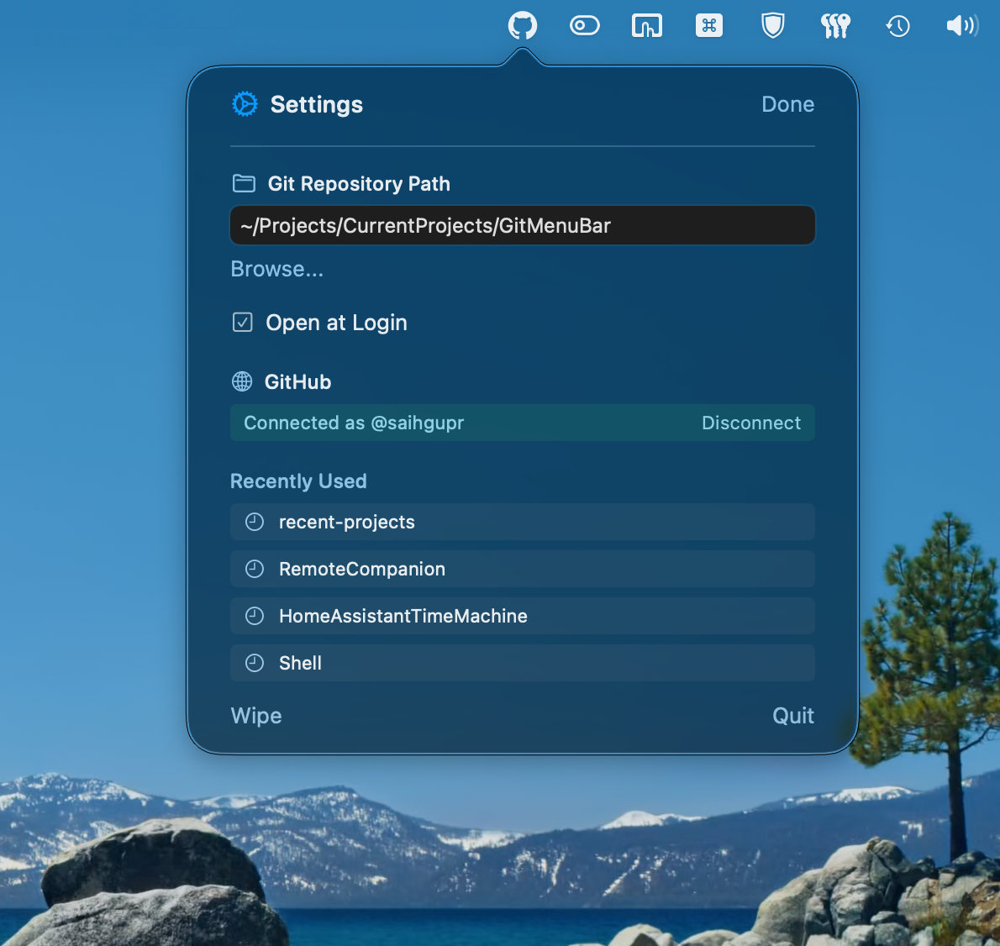
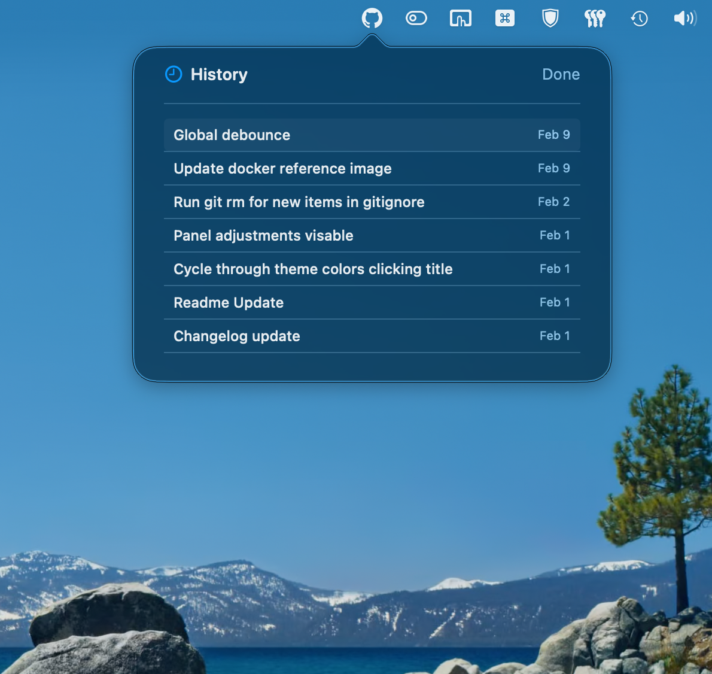
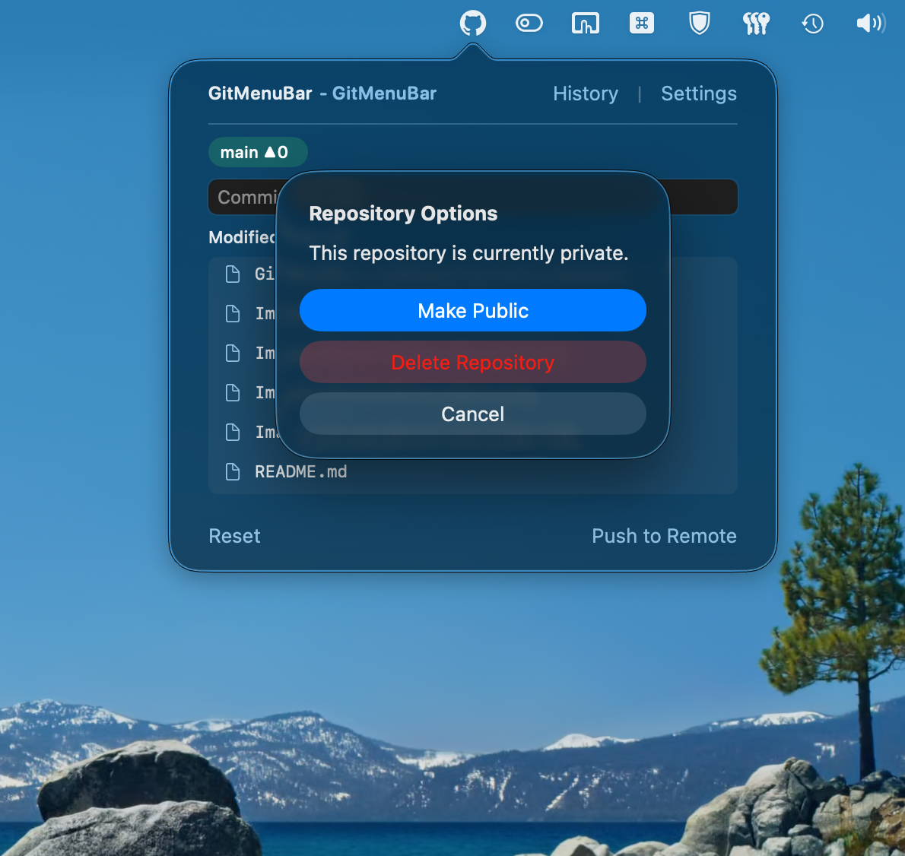

#  GitMenuBar

**GitMenuBar** is a native macOS menu bar application that simplifies
everyday Git operations. It focuses on clarity, safety, and speed by
removing unnecessary interface complexity and surfacing only the actions
most developers need during active work.



## Overview

GitMenuBar provides fast access to repository status, commits,
branching, and remote operations directly from the macOS menu bar. It is
designed for developers who want to stay focused on their work without
managing terminal commands or navigating large Git client interfaces.

The application emphasizes safe workflows by clearly explaining actions
and providing protective prompts when changes could lead to data loss.

## Design Goals

### Lightweight and Accessible

GitMenuBar operates entirely from the macOS menu bar, staying out of the dock and avoiding full-window clutter. It is highly efficient, using minimal system resources and occupying only about 5.2 MB of storage.

### Clear Git Workflows

All operations are described in straightforward language. Complex Git
states and operations are presented with clear explanations and guided
recovery options.

### Safety-Focused Operations

Potentially destructive actions require confirmation only when
necessary. The application helps prevent common mistakes such as
deleting unmerged branches or merging into protected branches
unintentionally.

## Core Features

### Repository Management

-   Quickly switch between multiple repositories
-   Automatically detect repository state and status
-   Initialize Git repositories from existing folders

### Commit Workflow

-   View modified, staged, and untracked files
-   Create commits directly from the menu bar
-   Optional one-step commit and push functionality

### Branch Management

-   Switch branches with automatic handling of uncommitted changes
-   Merge branches with preview and confirmation
-   Delete branches locally and remotely in a single action

### Remote Integration

-   Connect to GitHub for push, pull, and publishing features
-   Publish local repositories as private GitHub repositories
-   Synchronize repositories without leaving the menu bar

### Repository Reset Tools

-   Reset repository history while preserving working files
-   Useful for reinitializing projects or preparing clean repositories

## Screenshots

 
 

## Requirements

-   macOS 13.0 (Ventura) or newer
-   Git installed and available in system path

## Installation

### Download Release (Recommended)

1.  Visit the Releases page:\
    https://github.com/saihgupr/GitMenuBar/releases
2.  Download the latest version
3.  Launch the application

### Build from Source

1.  Clone the repository:

    ``` bash
    git clone https://github.com/saihgupr/GitMenuBar.git
    ```

2.  Open `GitMenuBar.xcodeproj` in Xcode

3.  Build and run the project using `⌘R`

## Setup

### Select a Repository

1.  Click the GitMenuBar icon in the macOS menu bar
2.  Open **Settings**
3.  Select **Choose Repository**
4.  Choose any local folder:
    -   Existing Git repositories are detected automatically
    -   Non-Git folders can be initialized directly from the app

### Connect GitHub (Optional)

Connecting GitHub enables push, pull, and publishing features.

1.  Open **Settings**
2.  Select **Connect GitHub**
3.  Complete the authentication process

## Usage

### Committing Changes

-   View changed files directly from the menu
-   Enter a commit message
-   Press:
    -   `Enter` to commit locally
    -   `Command + Enter` to commit and push

### Branch Management

Click the current branch name in the menu bar to open the Branch Menu:

-   **Switch:** Select any local branch to checkout
-   **Create:** Start a new branch from the current HEAD
-   **Rename:** Right-click any branch to rename it
-   **Merge/Delete:** Right-click other branches to merge them into your current branch or delete them
-   **Pull:** If your branch is behind remote, a "Pull" option appears at the top

If uncommitted changes exist when switching branches, the app provides options to carry changes safely.

### Features

#### Reset
Discards all current changes (staged and unstaged) and reverts files to the last commit.

#### Wipe
Creates a fresh "Initial commit" containing all your current files, deleting all previous history. This is perfect for restarting a project.

**Safety:** Before wiping, a full backup of your `.git` folder is created as `.git-backup-<timestamp>` and added to your `.gitignore`, ensuring you never lose history completely.

#### Advanced Options (Long-Press)
Click and hold the repository name at the top of the menu to:
-   **Toggle Visibility:** Change repository between Public and Private.
-   **Delete Repository:** Permanently delete the repository from GitHub.

## Contribution & Support

You can report issues or request features [here](https://github.com/saihgupr/GitMenuBar/issues).

GitMenuBar is **open-source** and **free** for everyone to use. If you like this project, please consider giving it a star ⭐ or making a small donation.