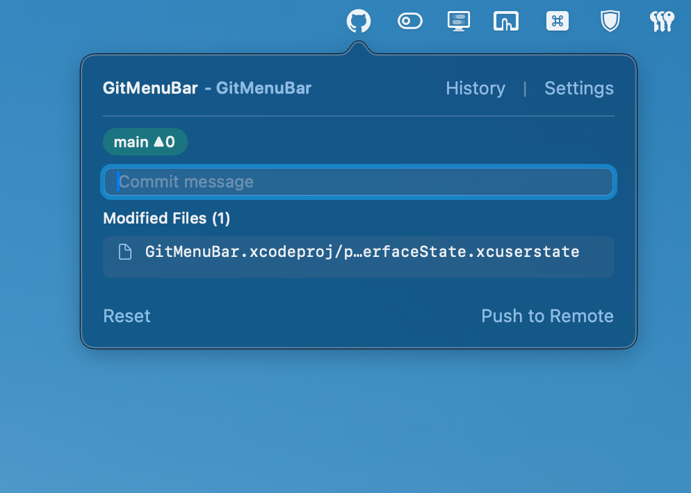
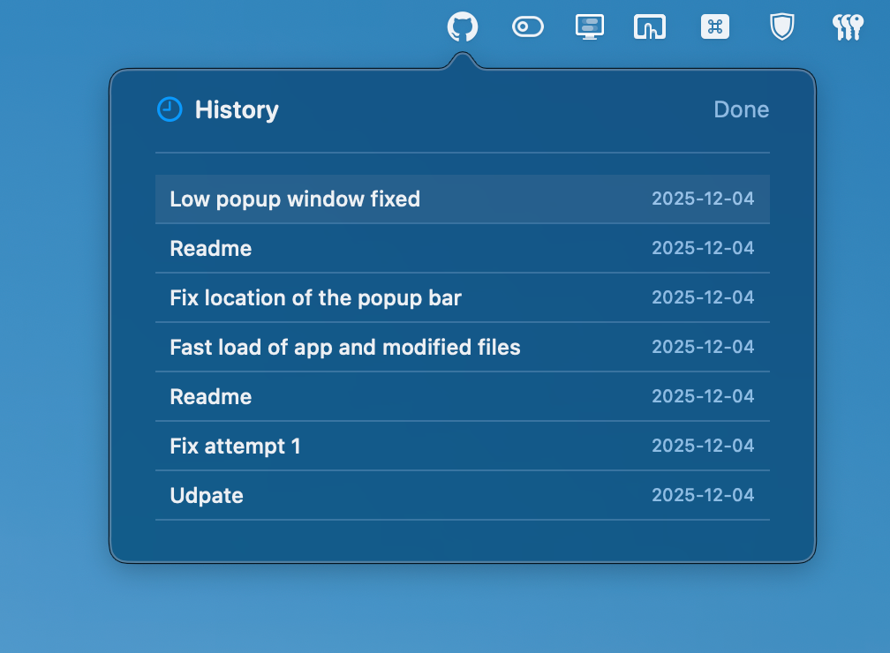
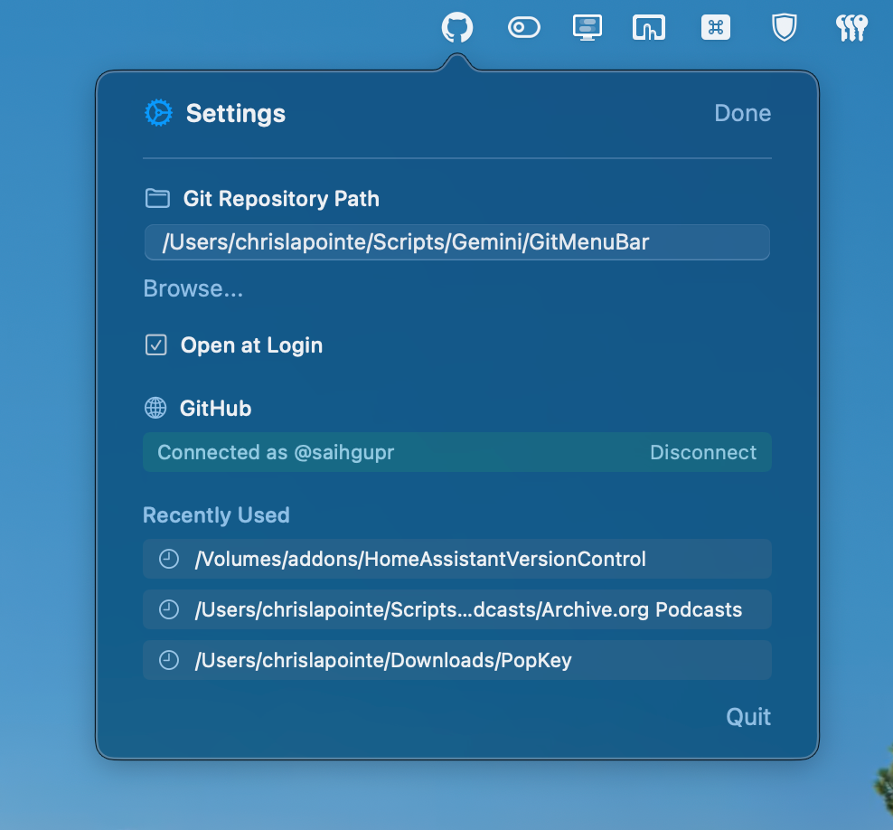

# GitMenuBar

GitMenuBar is a lightweight native macOS menu bar application that streamlines your Git and GitHub workflow. Manage your repositories, commit changes, view history, and sync with GitHub directly from your status bar without opening a terminal or a heavy GUI client.



## Features

- **Menu Bar Access:** Always-on access to your repository status, current branch, and commit counts.
- **Quick Commit & Push:** View modified files, enter a commit message, and push to remote in seconds.
- **History Explorer:** Browse commit history and reset to previous commits with a simple click.
- **GitHub Integration:** Securely connect with GitHub OAuth to manage remote repositories.
- **Create & Publish:** Turn any local folder into a Git repository and publish it directly to GitHub (Private or Public) from the app.
- **Multi-Repo Support:** Easily switch between recently used repositories.

## Screenshots

<p align="center">
  
  
  
</p>

## Requirements

- macOS 13.0+
- Xcode 14.0+ (for building)

## Installation

1. Clone the repository:
   ```bash
   git clone https://github.com/yourusername/GitMenuBar.git
   ```
2. Open `GitMenuBar.xcodeproj` in Xcode.
3. Ensure the signing team is selected in the project settings if you plan to run it on a device or distribute it.
4. Build and Run (Cmd+R).

## Usage

1. **Launch the App:** You will see the GitMenuBar icon in your macOS status bar.
2. **Select a Repository:** Go to **Settings** and choose a local directory that contains a Git repository, or select a folder to initialize a new one.
3. **Connect GitHub:** In **Settings**, click "Connect GitHub" to authorize the app. This enables the "Create & Publish" features.
4. **Commit Changes:** When you have changes, the icon will indicate pending work. Open the menu, type a message, and hit Enter to commit locally.
5. **Push:** Click "Push to Remote" to sync your changes with GitHub.

## Development

Built with **SwiftUI** and **AppKit**. The project uses a custom `GitManager` to handle shell commands for Git operations, ensuring lightweight performance without heavy library dependencies.

### Key Files
- `GitMenuBarApp.swift`: App entry point and lifecycle management.
- `GitManager.swift`: Core logic for executing Git commands.
- `GitHubAPIClient.swift`: Handles GitHub OAuth and API interactions.
- `MainMenuView.swift`: The primary UI for the menu bar popover.
