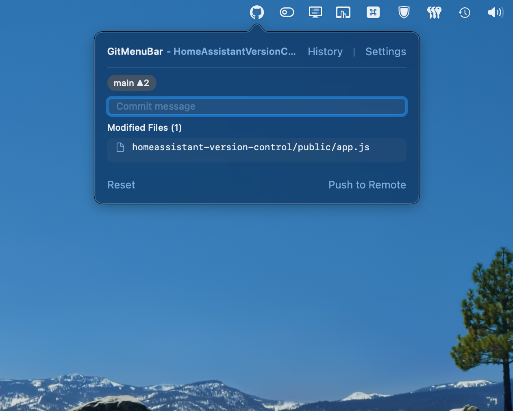
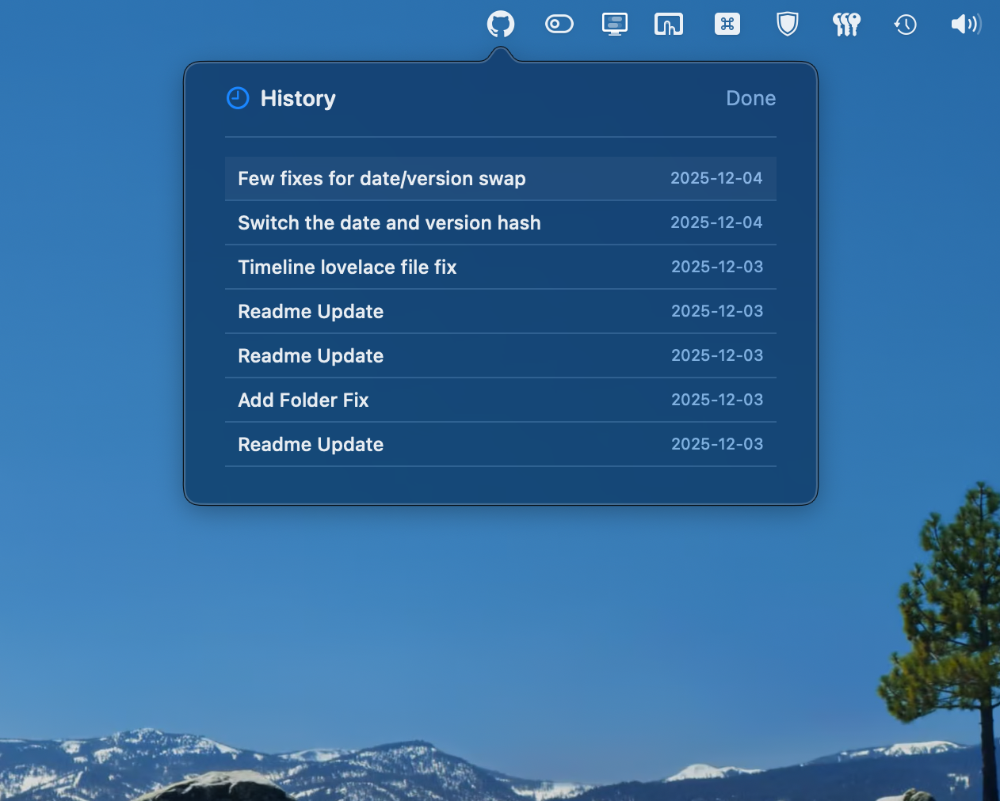
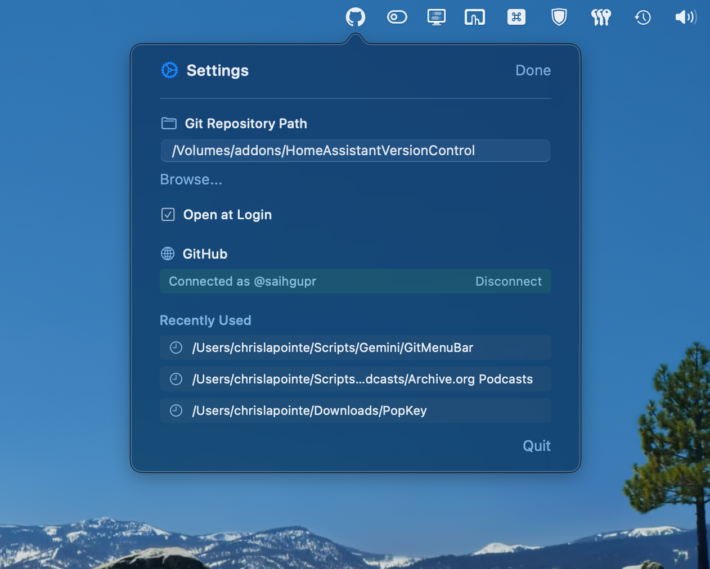
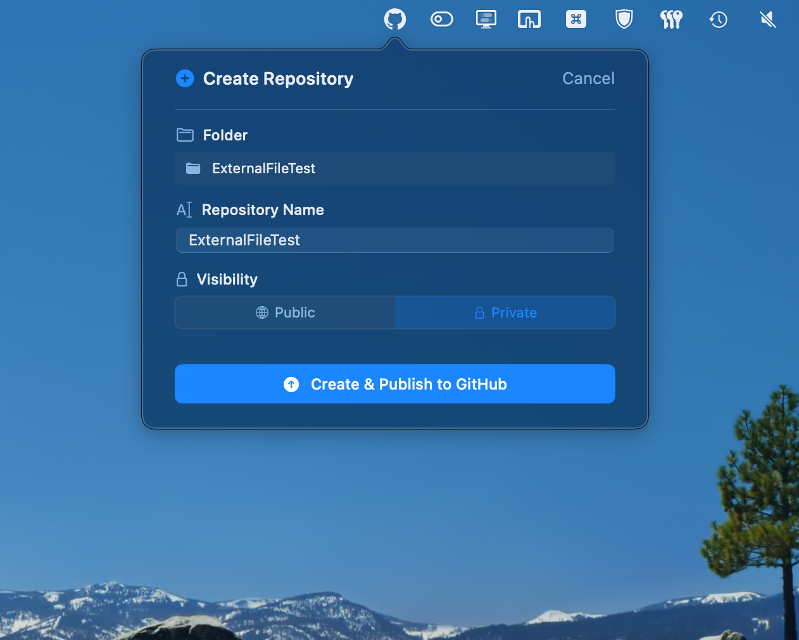
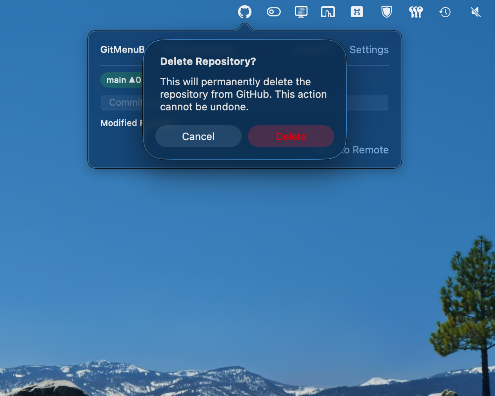

# [GitMenuBar](https://github.com/saihgupr/GitMenuBar)

GitMenuBar is a lightweight native macOS menu bar application designed for people who want the power of Git and GitHub without the complexity. It features a translucent glass design and focuses on making Git "human" by providing subtle guardrails, plain-English explanations, and one-click workflows—no terminal or heavy GUI client required.



## 🛡️ Git for Dummies (Features) Test

- **Subtle Guardrails:** Smart confirmations that only appear when you're doing something risky (like merging into `main` or deleting a primary branch).
- **"Switch & Carry Over":** Never lose uncommitted work. The app automatically stashes your changes, switches branches, and reapplies them—even when files differ between branches. Only fails on real conflicts.
- **Complete Branch Deletion:** When you delete a branch, it's removed from both your computer AND GitHub automatically. No ghost branches.
- **Detached HEAD Recovery:** If you accidentally end up "off-branch," the app detects it and helps you get back to safety with a single click.
- **Contextual Help:** Hover over any Git action (Merge, Delete, Pull) to see a plain-English explanation of exactly what it does.
- **Sync Status:** Visual indicators tell you at a glance if you have work to push, or if the remote repository has changes you need to pull.
- **Menu Bar Access:** Always-on access to your repository status, current branch, and commit counts.
- **Quick Commit & Push:** View modified files, enter a commit message, and push to remote in seconds.
- **History Explorer:** Browse commit history and reset to previous commits with a simple click.
- **GitHub Integration:** Securely connect with GitHub OAuth to manage remote repositories.
- **Create & Publish:** Turn any local folder into a Git repository and publish it directly to GitHub (Private or Public) from the app.
- **Multi-Repo Support:** Easily switch between recently used repositories.

<p align="center">
  
  
</p>
<p align="center">
  
  
</p>

## Requirements

- macOS 13.0+
- Xcode 14.0+ (for building)

## Installation

There are two ways to install GitMenuBar:

### 1. Download from Releases

The easiest way to get GitMenuBar is to download the latest `.app` from the [Releases page](https://github.com/saihgupr/GitMenuBar/releases).

1.  Download the `GitMenuBar.app.zip` file from the latest release.
2.  Unzip the file.
3.  Drag `GitMenuBar.app` to your Applications folder.
4.  Launch the app from your Applications folder.

### 2. Build from Source

If you prefer to build the application yourself, follow these steps:

1.  Clone the repository:
    ```bash
    git clone https://github.com/saihgupr/GitMenuBar.git
    ```
2.  Open `GitMenuBar.xcodeproj` in Xcode.
3.  Ensure the signing team is selected in the project settings if you plan to run it on a device or distribute it.
4.  Build and Run (Cmd+R).

## Usage (The Beginner's Workflow)

1. **Launch the App:** You will see the GitMenuBar icon in your macOS status bar.
2. **Select a Repository:** Go to **Settings** and choose a local directory. If it’s not a Git repo yet, the app will offer to initialize it for you.
3. **Commit & Push:** When you make changes, type a message in the box and hit **Enter** to save locally, or **Cmd+Enter** to save and send to GitHub in one go.
4. **Switching Branches:** Click the branch name to switch. If you have uncommitted work, the app will ask to "Carry Over" your changes so you don't lose them.
5. **Merging Safety:** To bring changes from `develop` into `main`, right-click `develop` and select **Merge**. The app will provide a confirmation explaining the action before it proceeds.
6. **Wipe Repository:** In **Settings**, click "Wipe" to reset your repository to a clean "Initial commit" state while keeping your current files. (Great for cleaning up messy history).
7. **Open with Folder Path:** Launch GitMenuBar with a specific project folder directly from the command line:
   ```bash
   open -a "GitMenuBar" /path/to/your/project
   ```

## Development

Built with **SwiftUI** and **AppKit**. The project uses a custom `GitManager` to handle shell commands for Git operations, ensuring lightweight performance without heavy library dependencies.

### Key Files
- `GitMenuBarApp.swift`: App entry point and lifecycle management.
- `GitManager.swift`: Core logic for executing Git commands.
- `GitHubAPIClient.swift`: Handles GitHub OAuth and API interactions.
- `MainMenuView.swift`: The primary UI for the menu bar popover.
